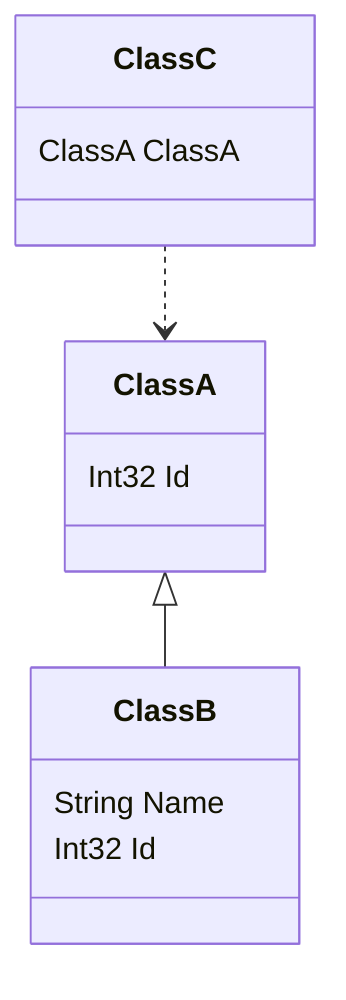

# Mermaid.Generator

Class diagram generator that can read Type information and generate mermaid class diagram. 

## Usage:

```csharp
string builder = DiagramFactory.CreateBuilder()
    .AddClass<ClassA>()
    .AddClass<ClassB>()
    .AddClass<ClassC>()
    .IncludeRelation(RelationType.Inheritance)
    .IncludeRelation(RelationType.Dependency)
    .Build();
```

Will generate:



## Feature development / TODO list

* Create extension that can scan namespaces, assemblies any class that implement given interface and add it to diagram. 
* Add options for diagram generations like:
  * Include/exclude properties
  * Include/exclude functions
  * Show also internal and private properties/functions
* Create and configure nuget package
* Publish nuget package
* Create this as a tool that can load builded assemblies and generate diagram from it. For example for some use in some pipelines for documentation. 
* Create project that will be source code generation nuget package to generate documentation during development 